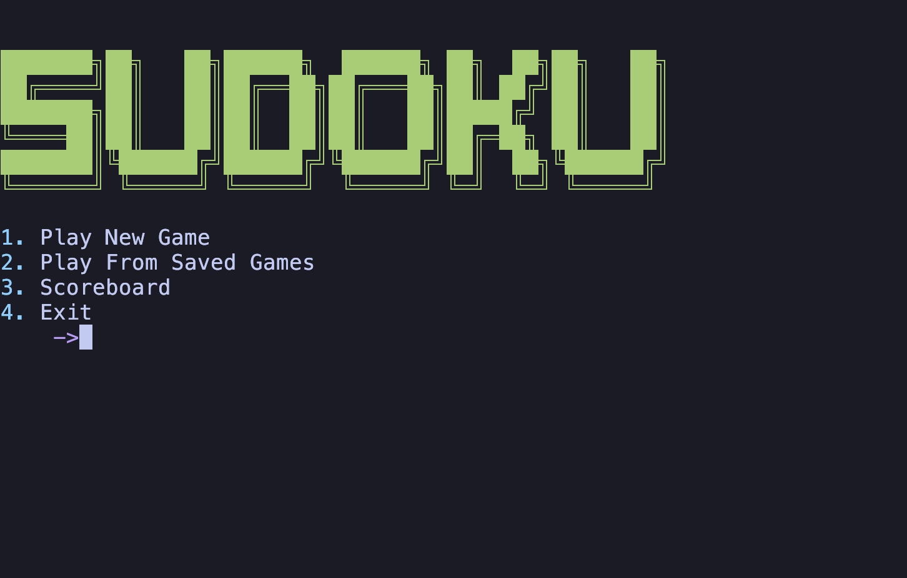
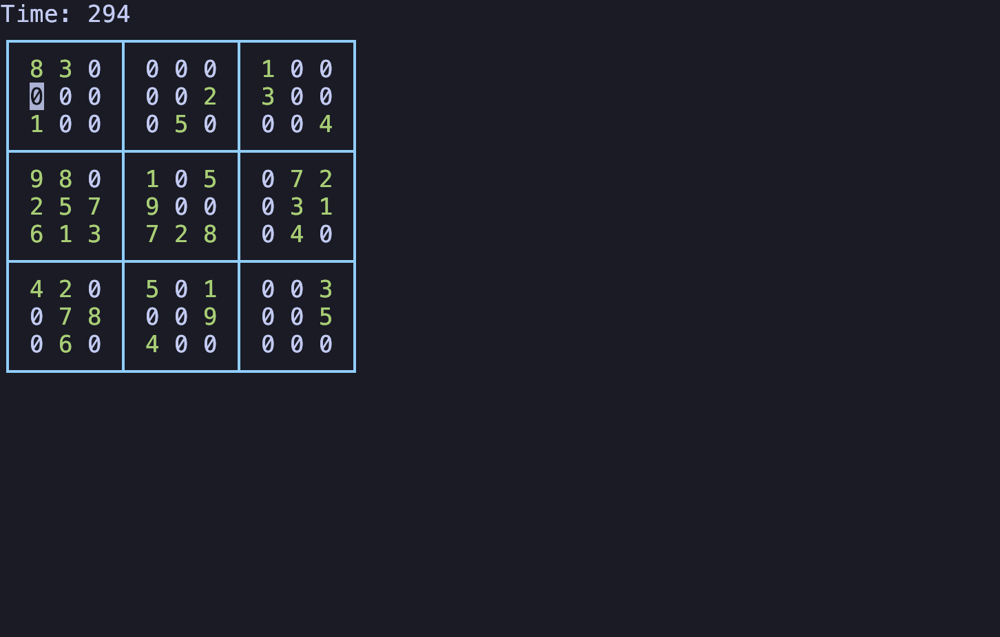
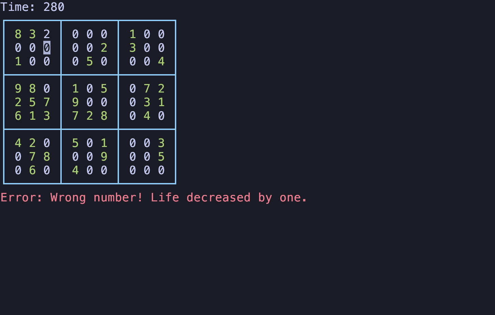
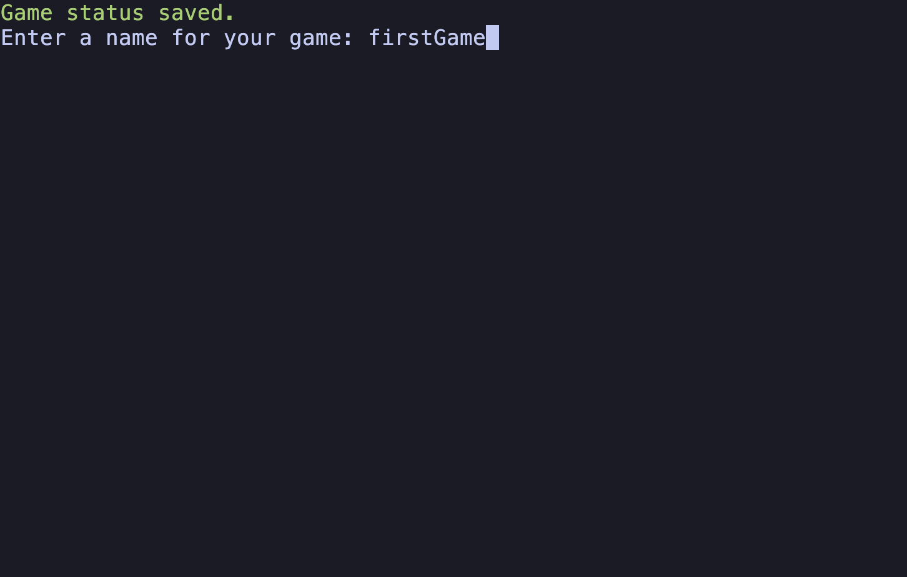
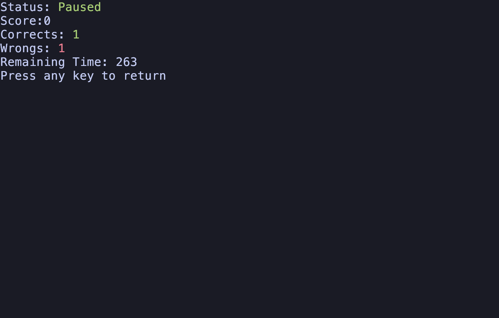
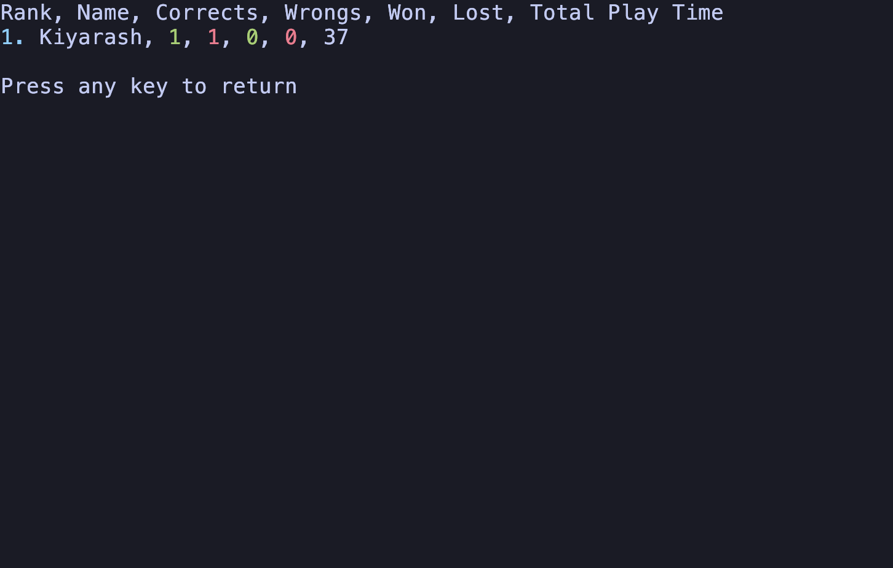

# Sudoku CLI Game

## Overview
This is a CLI game done as a BP project. It can be used to play sudoku directly inside terminal. 

## Features
- Multiple difficulty levels: Easy, Medium, Hard.
- Input validation to ensure correct moves.
- Leaderboard to compare yourself to other players.
- Save and load game progress.

## Attention!
This game is only supported for Linux and Unix based operating systems and currently won't run in Microsoft Windows.

## Installing And Running The Game
1. Clone the repository:
   
    ```bash
    git clone https://github.com/KiyarashFarahani/sudoku.git
    ```
3. Go to the project directory:
   
    ```bash
    cd sudoku
    ```
5. Compile the main file:
   
    ```bash
    g++ main.cpp
    ```
7. Run the game:
   
    ```bash
    ./a.out
    ```

## Walkthrough
After running the game, you'll be prompted to enter a username (note that it has to be a unique one). After that, you will see the main menu.



If you start a new game, you'll be prompted to choose difficulty. The difference between them is the time you have to solve the table.


After choosing diffculty, the game starts. As well as your timer!



- Use arrow keys on your keyboard to navigate to any cells in the table.
- Use `S` key to save your game and continue playing later.
- Use `ESC` to pause the game.
  - Pausing the game will pause the timer and also hide the table from you. Enter `ESC` again to resume.

If you enter an invalid value, your life decreases by one.



If you want to save, you have to enter a unique name for your game.



After saving, you will see the game status.



And you can also see the leaderboard

